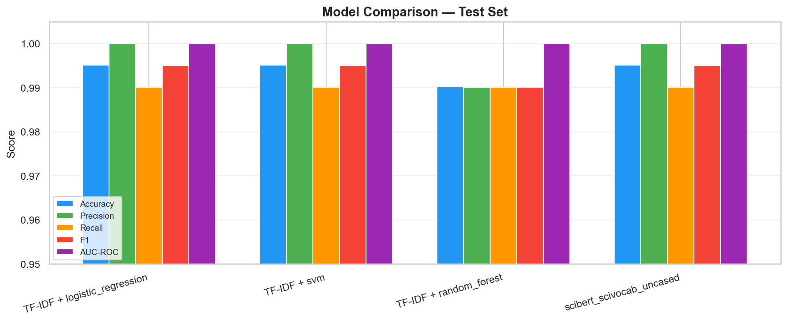
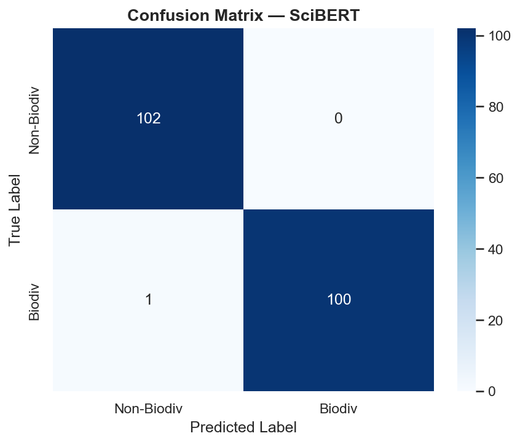
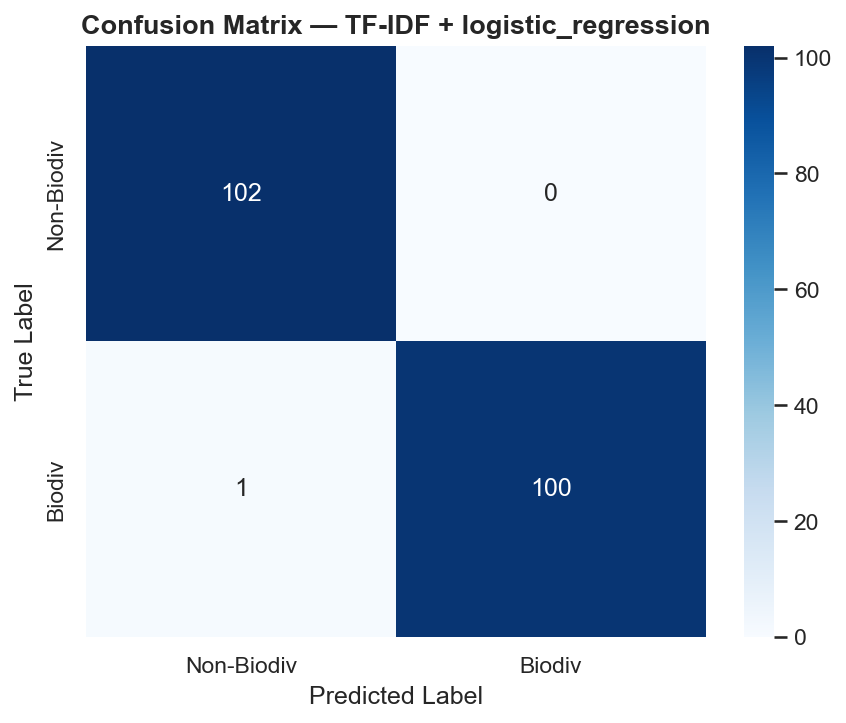
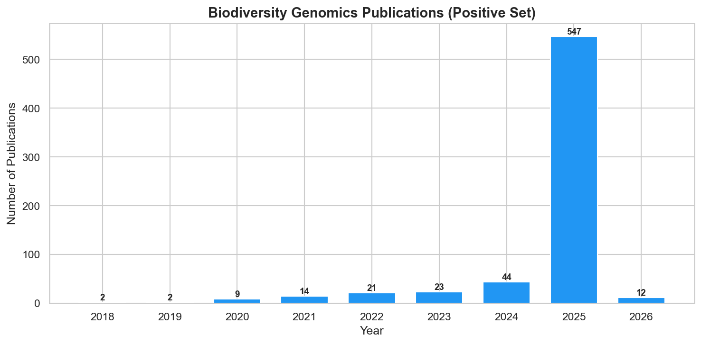
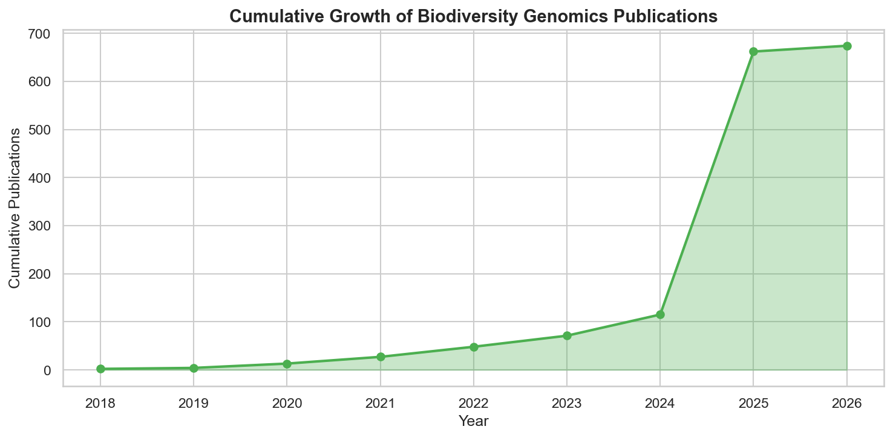
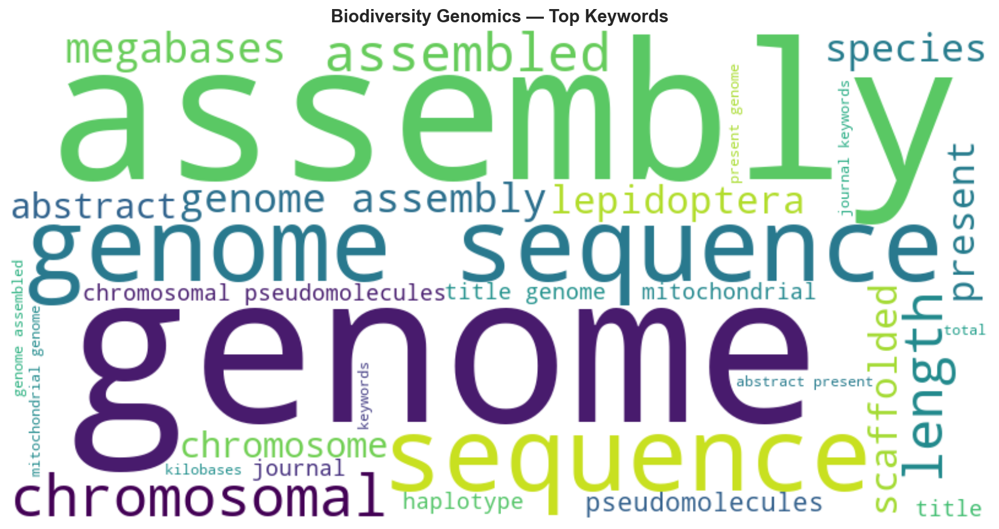
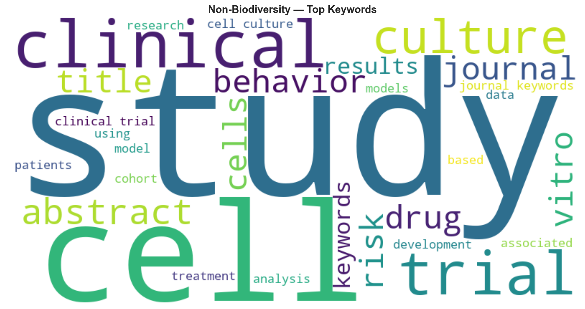

# 🧬 Biodiversity Publication Analyzer

> NLP-powered tool to discover, classify, and analyze the impact of biodiversity genomics publications using Europe PMC API.

**Built as preparation for GSoC 2026 — Wellcome Sanger Institute / EMBL-EBI**

[](https://www.python.org/downloads/)
[](https://pytorch.org/)
[](https://opensource.org/licenses/MIT)
[]()

---

## 🎯 Project Overview

This project builds an end-to-end NLP pipeline to:

1. **Discover** biodiversity genomics publications from Europe PMC (Darwin Tree of Life, Earth BioGenome Project, etc.)
2. **Classify** articles as biodiversity-genomics-related or not using ML models
3. **Analyze** the impact and trends of these publications over time

### Pipeline

```
Europe PMC API → Data Collection → Dictionary Matching → Feature Extraction
    → Baseline Classifiers (TF-IDF + LogReg/SVM/RF)
    → Transformer Classifier (SciBERT fine-tuned)
    → Impact Analysis (citations, trends, journals)
    → Visualizations & Reports
```

---

## 📊 Results

### Model Comparison (Test Set — 203 articles)

| Model | Accuracy | Precision | Recall | F1 | AUC-ROC |
|-------|----------|-----------|--------|-----|---------|
| **TF-IDF + Logistic Regression** | 0.9951 | 1.0000 | 0.9901 | **0.9950** | 1.0000 |
| **TF-IDF + SVM** | 0.9951 | 1.0000 | 0.9901 | **0.9950** | 1.0000 |
| TF-IDF + Random Forest | 0.9901 | 0.9901 | 0.9901 | 0.9901 | 0.9999 |
| **SciBERT (fine-tuned)** | 0.9951 | 1.0000 | 0.9901 | **0.9950** | 1.0000 |

> All models achieve 99%+ accuracy, confirming clear topical separation between biodiversity genomics and general biomedical literature. The transformer model adds value for edge cases and generalizes better to unseen query patterns.

### Dataset Statistics

| Property | Value |
|----------|-------|
| Total articles | 1,348 |
| Positive (biodiversity) | 674 |
| Negative (non-biodiversity) | 674 |
| Train / Val / Test | 943 / 202 / 203 |
| Year range | 2018–2025 |
| Sources | 8 positive + 4 negative Europe PMC queries |

### Impact Analysis Highlights

| Metric | Value |
|--------|-------|
| Peak year | 2025 (547 publications) |
| Average growth rate | 200.2% year-over-year |
| Open access rate | 82.0% |
| Top matched term | "genome assembly" (458/674 articles) |
| Highly cited (10+) | 54 articles |
| Max citations | 2,582 |

### Top Biodiversity Genomics Keywords (TF-IDF)

| Keyword | Score | Keyword | Score |
|---------|-------|---------|-------|
| genome | 0.0531 | assembled | 0.0273 |
| assembly | 0.0432 | megabases | 0.0270 |
| genome sequence | 0.0391 | genome assembly | 0.0262 |
| sequence | 0.0385 | species | 0.0243 |
| chromosomal | 0.0336 | scaffold | 0.0230 |

### Top Dictionary-Matched Terms

| Term | Articles | Term | Articles |
|------|----------|------|----------|
| genome assembly | 458 | Arthropoda | 194 |
| scaffold | 383 | Insecta | 187 |
| species | 355 | haplotype | 143 |
| mitochondrial genome | 273 | Tree of Life | 132 |
| reference genome | 244 | | |

### Sample Visualizations

#### Model Comparison


#### Confusion Matrices
| SciBERT | TF-IDF + Logistic Regression |
|---|---|
|  |  |

#### Publication Trends
| Timeline | Cumulative Growth |
|---|---|
|  |  |

#### Keyword Word Clouds
| Biodiversity Genomics | Non-Biodiversity |
|---|---|
|  |  |

---

## 🏗️ Project Structure

```
biodiversity-publication-analyzer/
├── configs/
│   └── default.yaml                  # All hyperparameters & settings
├── src/
│   ├── data/
│   │   ├── europepmc_client.py       # Europe PMC REST API client
│   │   ├── article_collector.py      # Positive + negative article collection
│   │   ├── preprocessing.py          # Text cleaning, splits, features
│   │   └── dataset.py                # PyTorch & HuggingFace datasets
│   ├── dictionary/
│   │   ├── term_collector.py         # 236 terms across 4 categories
│   │   ├── dictionary_builder.py     # Build, save, load dictionaries
│   │   └── dictionary_matcher.py     # Regex matching & relevance scoring
│   ├── models/
│   │   ├── baseline_classifier.py    # TF-IDF + LogReg/SVM/RF pipelines
│   │   ├── transformer_classifier.py # SciBERT fine-tuning pipeline
│   │   └── model_utils.py            # Comparison tables & helpers
│   ├── analysis/
│   │   ├── impact_metrics.py         # Citations, journals, OA rates
│   │   ├── trend_analysis.py         # Publication trends & growth
│   │   └── keyword_extraction.py     # TF-IDF & dictionary keywords
│   └── visualization/
│       └── plot_trends.py            # Timelines, comparisons, wordclouds
├── notebooks/
│   └── 01_api_exploration.ipynb      # Europe PMC API exploration
├── scripts/
│   ├── build_dictionary.py           # CLI: build term dictionary
│   ├── collect_articles.py           # CLI: collect from Europe PMC
│   ├── train_baseline.py             # CLI: train TF-IDF classifiers
│   ├── train_transformer.py          # CLI: fine-tune SciBERT
│   └── analyze_impact.py             # CLI: full impact analysis
├── tests/
│   ├── conftest.py                   # Shared fixtures
│   ├── test_europepmc_client.py      # API client tests (10)
│   ├── test_dictionary.py            # Dictionary tests (18)
│   ├── test_preprocessing.py         # Preprocessing tests (24)
│   ├── test_classifiers.py           # Classifier tests (12)
│   ├── test_metrics.py               # Impact metrics tests (10)
│   └── test_visualization.py         # Visualization tests (7)
├── data/
│   ├── raw/                          # Downloaded articles (CSV)
│   ├── processed/                    # Train/val/test splits
│   └── dictionaries/                 # Built term dictionaries
└── results/
    ├── models/                       # Saved model checkpoints
    ├── figures/                       # Generated plots
    └── reports/                      # Metrics & analysis JSONs
```

---

## 🚀 Quick Start

### 1. Installation

```bash
# Clone
git clone https://github.com/AswaniSahoo/biodiversity-publication-analyzer.git
cd biodiversity-publication-analyzer

# Create virtual environment
python -m venv .venv
.venv\Scripts\activate  # Windows
# source .venv/bin/activate  # Linux/Mac

# Install dependencies
pip install -r requirements.txt
```

### 2. Build Dictionary

```bash
python -m scripts.build_dictionary
# Output: 236 terms across 4 categories → data/dictionaries/biodiversity_terms.json
```

### 3. Collect Articles

```bash
# Quick test (50 per query, ~15 sec)
python -m scripts.collect_articles --max-per-query 50

# Full collection (200 per query, ~5 min)
python -m scripts.collect_articles --max-per-query 200
```

### 4. Preprocess Data

```python
from src.data.preprocessing import preprocess_dataframe, create_splits, save_splits
import pandas as pd

df = pd.read_csv("data/raw/articles.csv")
df = preprocess_dataframe(df)
splits = create_splits(df)
save_splits(splits)
```

### 5. Train Models

```bash
# Baseline classifiers (TF-IDF + LogReg/SVM/RF)
python -m scripts.train_baseline

# SciBERT transformer (GPU recommended, ~20 min on RTX 3050)
python -m scripts.train_transformer --batch-size 8 --epochs 3

# CPU fallback (slower, ~2 hours)
python -m scripts.train_transformer --device cpu --batch-size 4 --epochs 3
```

> **GPU Note:** For CUDA-enabled PyTorch, install separately:
> ```bash
> pip install torch torchvision torchaudio --index-url https://download.pytorch.org/whl/cu124
> ```

### 6. Impact Analysis

```bash
python -m scripts.analyze_impact
# Generates: reports + 7 figures
```

### 7. Run Tests

```bash
pytest tests/ -v
# 81 tests across 6 test files
```

---

## 🔧 Configuration

All settings in `configs/default.yaml`:

```yaml
# Key settings
api:
  base_url: "https://www.ebi.ac.uk/europepmc/webservices/rest"
  rate_limit_delay: 0.5

data:
  positive_queries:  # 8 biodiversity genomics queries
  negative_queries:  # 4 non-biodiversity queries
  max_articles_per_query: 500

baseline:
  max_features: 10000
  ngram_range: [1, 2]
  models: [logistic_regression, svm, random_forest]

transformer:
  model_name: "allenai/scibert_scivocab_uncased"
  max_length: 512
  batch_size: 16
  epochs: 5
```

---

## 🧪 Testing

**81 comprehensive tests** across 6 test files:

| Test File | Tests | Coverage |
|-----------|-------|----------|
| `test_europepmc_client.py` | 10 | API client, search, pagination, metadata |
| `test_dictionary.py` | 18 | Term collection, building, matching, scoring |
| `test_preprocessing.py` | 24 | Text cleaning, splitting, dataset classes |
| `test_classifiers.py` | 12 | Fit, predict, evaluate, save/load |
| `test_metrics.py` | 10 | Citations, journals, trends, keywords |
| `test_visualization.py` | 7 | Plot generation, file output, chart types |

---

## 🎯 How This Maps to the Sanger GSoC Project

| Sanger GSoC Step | Our Implementation |
|---|---|
| 1. Build specialized dictionary | ✅ `dictionary_builder.py` — 236 terms, 4 categories |
| 2. Data collection from Europe PMC | ✅ `europepmc_client.py` — full API client with pagination |
| 3. Annotation using dictionary | ✅ `dictionary_matcher.py` — regex matching + relevance scoring |
| 4. Language pattern recognition | ✅ TF-IDF features, keyword extraction |
| 5. ML-based classification | ✅ Baselines + SciBERT (99.5% F1) |
| *Bonus: Impact analysis* | ✅ Citations, trends, journals, word clouds |

---

## 📚 References

1. **Europe PMC** — [europepmc.org](https://europepmc.org/)
2. **Darwin Tree of Life** — [darwintreeoflife.org](https://www.darwintreeoflife.org/)
3. **Earth BioGenome Project** — [earthbiogenome.org](https://www.earthbiogenome.org/)
4. **SciBERT** — Beltagy et al. (2019) — [arXiv:1903.10676](https://arxiv.org/abs/1903.10676)
5. **BioBERT** — Lee et al. (2020) — [arXiv:1901.08746](https://arxiv.org/abs/1901.08746)
6. **Attention Is All You Need** — Vaswani et al. (2017) — [arXiv:1706.03762](https://arxiv.org/abs/1706.03762)

---

## 👤 Author

**Aswani Sahoo** — [@AswaniSahoo](https://github.com/AswaniSahoo)

---

## 📝 License

MIT License — see [LICENSE](LICENSE) for details.

---

<p align="center">
  <i>Built with ❤️ as preparation for GSoC 2026 — AI for Science</i>
</p>